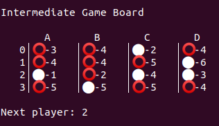

# Programação em Lógica - Trabalho Prático

## Identificação

- Identificação do trabalho: Swack_2
- Elementos do Grupo:
    - João Carlos Machado Rocha Pires (up201806079)
    - Maria Marta Nunes Andrade Lobo dos Santos (up201604530)
- Turma Prática 5

## Instalação e Execução do Jogo
Consultar o ficheiro swack.pl e executar com 'play.' no SicStus.

## O Jogo Swack

Swack é um jogo de tabuleiro para dois jogadores (Vermelho/Branco). O tabuleiro é um quadrado 4x4, com células quadradas.

No início, todas as células estão preenchidas com peças vermelhas/brancas de forma alternada, em xadrez. Em tabuleiros com número de células ímpares, a célula central é preenchida com uma peça branca. Cada jogador tem um número de peças infinitas da sua cor fora do tabuleiro.

Células adjacentes significam células ortogonalmente adjacentes.

Uma stack é um conjunto de uma ou mais peças empilhadas dentro da mesma célula. A cor da stack é a cor da peça do topo, que determina o seu “dono”. O tamanho da stack é o número de peças nela contidas.

Um grupo é um conjunto de stacks adjacentes de cor igual. O tamanho de um grupo corresponde ao número de stacks que o formam.

O jogador com as peças vermelhas começa e as jogadas são feitas de forma alternada. 

Em cada jogada, o jogador poderá:

- Passar

- Mover uma peça da sua cor do topo de uma stack para uma stack adjacente cuja cor seja a do adversário, considerando que o tamanho de ambas as stacks é igual antes da realização do movimento. Depois, colocar uma peça da cor do adversário, exterior ao tabuleiro, no topo da stack de onde a peça do atual jogador foi retirada.

O jogo termina quando os jogadores decidem passar de forma consecutiva. O jogador com a maior pontuação vence. A pontuação corresponde ao tamanho do maior grupo. Em caso de empate, cada jogador adiciona à sua pontuação o tamanho do seu segundo maior grupo. Caso o empate continue, volta-se a adicionar o tamanho do terceiro maior grupo e assim sucessivamente. Em tabuleiros ímpares, se estiver empatado mesmo depois da aplicação dos critérios de desempate, vence quem fez o último movimento.


## Lógica do jogo

### Representação interna do estado do jogo

Para representar as peças do jogo, optamos por atribuir o valor '1' às peças vermelhas, ou seja, do jogador 1, e o valor '2' às peças brancas, do jogador 2.

O tabuleiro é representado usando uma lista que contem várias listas, cada uma referente a uma linha do tabuleiro. Por sua vez, cada elemento de cada linha, ou seja, cada célula, é também uma lista, sendo o primeiro elemento o valor correspondente à peça do topo (valor 1 - peça vermelha no topo; valor 2 - peça branca no topo). Os restantes elementos, se houver mais do que uma peça na célula, ou seja, se o tamanho da stack for maior do que 1, estão ordenados desde o segundo, isto é, a partir do que está imediatamente abaixo da peça do topo até à base da stack.

No início do jogo, as listas correspondentes às células têm aridade 1 dado que apenas se encontra uma peça por célula. Daí em diante, mediante a jogabilidade, a aridade vai variando. 

A indicação do próximo jogador a efetuar uma jogada surge após a visualização gráfica do tabuleiro. Se o predicado *display_game/2* receber o valor 1 como segundo argumento, o próximo jogador a efetuar uma ação será o jogador 1. Se receber o valor 2, será o jogador 2.

Relativamente às peças extra, inicialmente posicionadas fora do tabuleiro, ainda que na prática tal não fosse possível, decidimos que seriam em número infinito. A razão para tal deve-se ao facto de que a regra de término do jogo não é a ausência de peças, mas sim a passagem em duas jogadas sucessivas. Ou seja, se tivéssemos definido que, por exemplo, cada jogador teria 30 peças da sua cor exteriores ao tabuleiro no início do jogo, como em cada jogada em que o jogador move uma das suas peças tem de colocar uma peça do adversário exterior ao tabuleiro, correríamos o risco de o jogo terminar por falta de peças exteriores, o que não consta nas regras. Desta forma, e para não sobrecarregar a visualização gŕafica do jogo, não colocamos nenhuma informação nos predicados de *display* sobre as peças exteriores uma vez que serão sempre em número infinito.

De seguida, mostram-se, respetivamente, as representações em PROLOG de três estados do jogo: inicial, intermédio e final.

- Inicial

```
/* initial board configuration */

		/* LINHA 0 */
first(A) :- A = [[[2],
                [1],
		[2],
		[1]],
		/* LINHA 1 */
		[[1],
		[2],
		[1],
		[2]],
		/* LINHA 2 */
		[[2],
		[1],
		[2],
		[1]],
		/* LINHA 3 */
		[[1],
		[2],
		[1],
		[2]]].
```

- Intermédio

```
/* intermediate board configuration */

			/* LINHA 0 */
intermediate(A) :- A = [[[1, 1, 2],
			[1, 1, 2, 1],
			[2, 2],
			[1, 2, 1, 1]],
			/* LINHA 1 */
			[[1, 2, 1, 2],
			[1, 1, 2, 1],
			[1, 2, 1, 1, 2],
			[2, 1, 2, 1, 1, 1]],
			/* LINHA 2 */
			[[2],
			[1, 1],
			[2, 2, 2, 2],
			[2, 2, 2]],
			/* LINHA 3 */
			[[1, 2, 2, 2, 2],
			[2, 1, 1, 1, 1],
			[1, 2, 2, 2, 1],
			[1, 1, 1, 2]]].
```

- Final

```
/* final board configuration */

		/* LINHA 0 */
final(A) :- A = [[[1, 1, 2, 1],
		[1, 1, 2, 1],
		[1, 2],
		[1, 2, 1, 1]],
		/* LINHA 1 */
		[[1, 2],
		[2, 1, 1],
		[2, 2],
		[2, 1, 2, 1]],
		/* LINHA 2 */
		[[1, 2, 2, 1, 2],
		[2, 1, 1, 1],
		[2, 2, 2, 2],
		[1, 2, 2]],
		/* LINHA 3 */
		[[1, 2],
		[1, 1, 1, 1],
		[1, 2],
		[2, 1, 1, 2]]].
```

### Visualização do estado do jogo

Para a implementação do predicado de visualização do estado de jogo, recorremos ao predicado *display_game/2*, que recebe o estado do jogo e o número do jogador a efetuar a próxima jogada. 

Este predicado invoca o predicado *printBoard/2* que, recebendo o tabuleiro a ser impresso (a ser alterado a cada jogada) e o tamanho do mesmo, imprimirá as células e as peças nas suas posições. Optou-se por apresentar apenas a peça do topo de cada *stack*, dado que as restantes não influenciam a jogada. Colocamos ainda um valor por célula correspondente ao tamanho da *stack*.

Após o *display* do tabuleiro, indicamos qual o próximo jogador. 

Exemplos de 3 estados do jogo (o estado inicial será sempre assim):

- Estado Inicial

```
display_game(first, 1).
```


- Estado Intermédio

```
display_game(intermediate, 2).
```



- Estado Final

```
display_game(final, 1).
```


Após a invocação do predicado *play/0*, o utilizador deverá indicar o modo de jogo.

O resultado visual após a seleção de uma opção é:

- Player vs Player (Opção 1)


- Player vs Computer (Opção 2)


- Computer vs Computer (Opção 3)


Após a indicação da cor da peça de cada jogador, aparece o tabuleiro no seu estado inicial.

### Lista de Jogadas Válidas
As jogadas válidas são as seguintes:
- a peça escolhida do topo da stack é da cor do jogador atual
- a peça no topo da stack escolhida para colocar a peça em jogo, é da cor do adversário
- o tamanho de ambas as stacks é igual antes da realização do movimento anterior
- as stacks são ortogonalmente adjacentes  
O predicado `valid_moves(+GameState, +Player, -ListOfMoves)` consiste na obtenção de uma lista com jogadas possíveis. 
Neste predicado, uma vez que há pontos no tabuleiro que não têm 4 stacks adjacentes,  são analisados os casos especiais tais como os quatro cantos do tabuleiro (2 stacks adjacentes), assim como as stacks pertencentes às linhas e colunas que o delimitam (3 stacks adjacentes).

### Execução de Jogadas
O predicado `repeatCycle(Player, Pass, Board, NOption)` inicia uma jogada, recebendo a informação se o jogador pretende jogar ou passar, sendo NOption o modo de jogo selecionado.
O predicado `move(+GameState, +Move, -NewGameState)` consiste na validação, execução e obtenção de um novo estado de jogo. Começa por receber o input do jogador com `getInputPlay(Col, Lin)` que diz respeito à posição da peça que pretende mover e com `getFInputPlay(Col, Lin)` que considera a posição que esta peça irá ocupar. `validateColumn` e `validateLine` verificam se os inputs do utilizador correspondem de facto a uma coordenada existente. De seguida, averigua-se a exequibilidade da jogada, avaliando se satisfaz as condições anteriormente expostas. Por fim, se passar as verificações com sucesso é finalizada a jogada com o predicado `replace` que reposiciona a peça em jogo.

### Final do Jogo
O jogo termina se, e só se, ambos os jogadores passarem em duas jogadas sucessivas. Quando estamos perante estas condições, o predicado `game_over(+GameState, -Winner)` identifica qual o vencedor do jogo. Este predicado calcula o tamanho dos grupos de cada jogador.
Parte do código utilizado para determinar o tamanho dos grupos dos jogadores foi adaptado do trabalho de um ano anterior, da autoria Mário Gil e André Rocha (https://github.com/andrefmrocha/Fuse-GI). Este reaproveitamento está devidamente identificado no respectivo ficheiro de código.
**missing escrever sobre os ficheiros**

### Avaliação do Tabuleiro
**missing**
`value(+GameState, +Player, -Value)`

### Jogada do Computador
**missing**
`choose_move(+GameState, +Player, +Level, -Move)`

#### Nível Fácil
A jogada do computador é escolhida aleatoriamente entre o conjunto de jogadas válidas.

#### Nível Difícil
A jogada do computador é escolhida de forma a dificultar o adversário, isto é, de forma a maximizar o número de stacks adjacentes do computador.


## Conclusões


## Bibliografia

- https://stackoverflow.com/questions/4805601/read-a-file-line-by-line-in-prolog

- https://github.com/andrefmrocha/Fuse-GI

- https://stackoverflow.com/questions/16174681/how-to-delete-the-last-element-from-a-list-in-prolog

- https://boardgamegeek.com/boardgame/314462/swack


